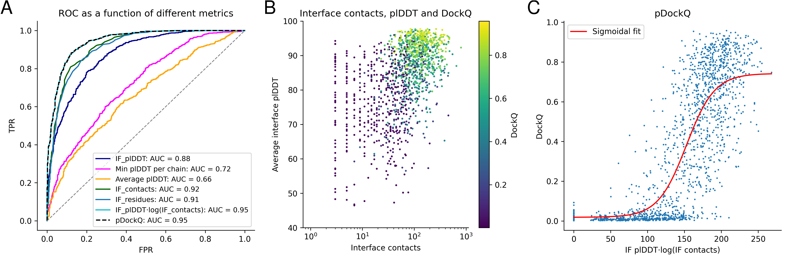

# FoldDock


This repository contains the simultaneous folding and docking protocol **FoldDock**.

The protocol has been developed on 216 heterodimeric complexes from [Dockground](http://dockground.compbio.ku.edu/downloads/unbound/benchmark4.tar.bz2)
and tested on [1481 heterodimeric complexes extracted from the PDB](https://www.nature.com/articles/s41467-021-21636-z).


The protocol uses the recently published state-of-the-art end-to-end protein structure predictor [AlphaFold2](https://github.com/deepmind/alphafold) to predict the structure of heterodimeric complexes.
\
AlphaFold2 is available under the [Apache License, Version 2.0](http://www.apache.org/licenses/LICENSE-2.0) and so is FoldDock, which is a derivative thereof.  \
The AlphaFold2 parameters are made available under the terms of the [CC BY 4.0 license](https://creativecommons.org/licenses/by/4.0/legalcode) and have not been modified.
\
\
**You may not use these files except in compliance with the licenses.**

**The success rate of the final protocol is 63% on the test set**. By analyzing the predicted interfaces, we are able to distinguish accurate models with an AUC of 0.94 on the test set. For more information on this pipeline and its performance see
[Improved prediction of protein-protein interactions using AlphaFold2 and extended multiple-sequence alignments](https://www.biorxiv.org/content/10.1101/2021.09.15.460468v1)

## 2FYU | DockQ=0.94
The entire 2FYU complex is depicted in gray and the two modeled chains C in green and D in blue.


## Installation
This repository contains a patched version of AlphaFold2 while all needed packages are supplied running commands in a Singularity image.
The only requirement for running **FoldDock** is therefore singularity, which can be installed by following: https://sylabs.io/guides/3.0/user-guide/quick_start.html

To obtain **FoldDock** do:

```
git clone https://gitlab.com/ElofssonLab/FoldDock.git
```

Then, to adjust any left requirement, run:

```
cd FoldDock
bash setup.sh
```


## Full Pipeline
The full procedure described in [Improved prediction of protein-protein interactions using AlphaFold2 and extended multiple-sequence alignments](https://www.biorxiv.org/content/10.1101/2021.09.15.460468v1) is provided through the run_pipeline.sh script.

To launch it, we recommend to create a folder containing the target protein input file/s and run from inside that folder:

```
FOLDDOCK_PATH="absolute path to FoldDock directory on your system"
bash $FOLDDOCK_PATH/run_pipeline.sh file1 file2
```

Running the script in this way accepts both files in fasta (sequence) or a3m (multiple sequence alignments) formats. Structure files can also be used in this script to derive input sequences and compare final models with real structures (this is NOT a way to provide templates in modelling). To do this, you need to specify input structures in .pdb or .cif formats and a chain id as follows:

```
FOLDDOCK_PATH="absolute path to FoldDock directory on your system"
bash $FOLDDOCK_PATH/run_pipeline.sh file1 file2 chain_id1 chain_id2
```

To test that everything works properly you can run:

```
FOLDDOCK_PATH="absolute path to FoldDock directory on your system"
cd $FOLDDOCK_PATH/test/

bash $FOLDDOCK_PATH/run_pipeline.sh 1ay7_u1.fasta 1ay7_u2.fasta
```

Substitute the last command with the following one to test the pipeline with a pre-generated MSA:

```
bash $FOLDDOCK_PATH/run_pipeline.sh 1ay7_A.a3m 1ay7_B.a3m
```

Launch the next one to test the pipeline with an input structure instead:

```
bash $FOLDDOCK_PATH/run_pipeline.sh 1ay7.pdb 1ay7.pdb A B
```

The full pipeline execution takes approximately 30 minutes on a setup with Intel i5 9600k 4.7Gh CPU and Nvidia RTX2080Super GPU

The predicted interface lDDT (plDDT) and the number of contacts in the predicted interface can be used to score modeled structures using a simple sigmoidal function. We create a continuous scoring function using these metrics:

**pDockQ** = L/{1+exp(-k(x-x0))} + b , \
where x = average interface plDDT⋅log(number of interface contacts) and L= 0.724 x0= 152.611 k= 0.052 and b= 0.018.\
\
To calculate the pDockQ score from a predicted complex run: **./src/pdockq.py** and provide the pdbfile and .pkl file from AlphaFold2. \
The script **score.sh** contains an example of how to run the scoring using a predicted structure. Note that the pdbfile has to be rewritten to contain two chains (see score.sh).

```
bash score.sh
```
\
\
Using pDockQ results in an average error of 0.1, which enables separation of acceptable models (DockQ≥0.23) with an AUC of 0.95.





IMPORTANT:
- file1 and file2 names always need to end with .fasta or .a3m or .pdb or .cif
- the same format must be used for both files
- each sequence contained in fasta and MSA files need to be on a single line
- running the pipeline with structure input will yield a DockQ score as well, after comparing the final models with the two input chains joined in the same structure.
- the pipeline will yield several intermediate files in the working directory where it is launched so we do recommend to create a dedicate folder for each run.
- This pipeline is not optimised for homodimers. Homodimers are favorable to run with unpaired alignments, using e.g. only the fused alignments.
- Note that pDockQ is not calibrated for overlapping proteins, which can be observed when modelling some homomeric proteins.

**Copyright 2021 Patrick Bryant, Gabriele Pozzati and Arne Elofsson**

Licensed under the Apache License, Version 2.0 (the "License"); \
you may not use this file except in compliance with the License. \
You may obtain a copy of the License at http://www.apache.org/licenses/LICENSE-2.0
